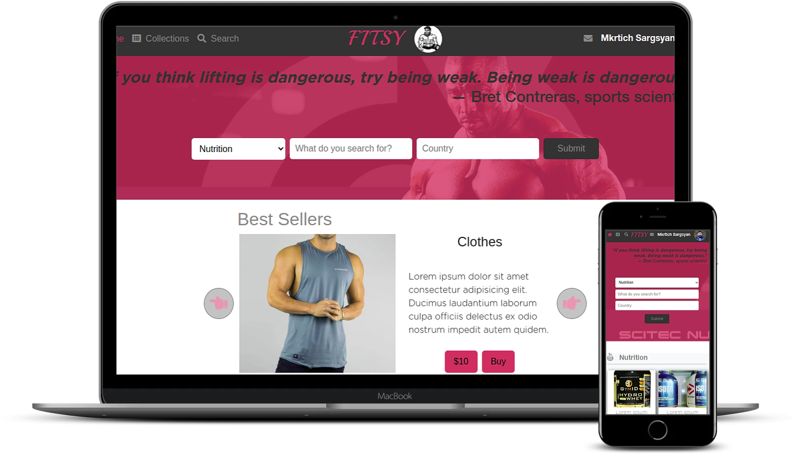

# Fitness shop

> This project is for selling gym goods.

> This project is based on an online shop for electronics. Design is followed from this website https://www.behance.net/gallery/24796463/ZATTIX , but instead of a shop of electronics I created gym goods selling website

## Built With

- HTML
- CSS3
- Font awesome icons
- Scss
- Bootstrap 4

## Watch a video presentation of the project 

[watch loom video]('https://www.loom.com/share/8ed08e815f2645f2b1787a35f2c83cb6').

## Live Demo

[Live Demo Link for index.html](https://mkrtichsargsyan.github.io/Fitness-Shop/)

[Live Demo Link for search-page.html](https://rawcdn.githack.com/MkrtichSargsyan/Fitness-Shop/11cfdd96c0ecbe3853f55077931a7a37baf87db5/search-page.html)

## To get a local copy up and running follow these simple example steps.

### Setup

Clone the project locally.

### Linters

1. run `npm install`.
2. run `npm run test` to check the Html and CSS files.

### Deployment

Install and run a live server plugin on you IDE/Text editor and run it from the root directory.

If want to edit the files using SASS compiler:

1. Install a SASS processor;
2. Run npm install;
3. Run npm run sass;

And edit the .scss files.

## Authors

👤 **Mkrtich Sargsyan**

- Github: [@githubhandle](https://github.com/MkrtichSargsyan)
- Twitter: [@twitterhandle](https://twitter.com/MkrtichSargsyan)
- Linkedin: [linkedin](https://www.linkedin.com/in/mkrtich-sargsyan-921ab0152/)
- Email:  mkrtichsargsyan24@gmail.com

## Show your support

Give a ⭐️ if you like this project!

## 📝 License

This project is [MIT](lic.url) licensed.
